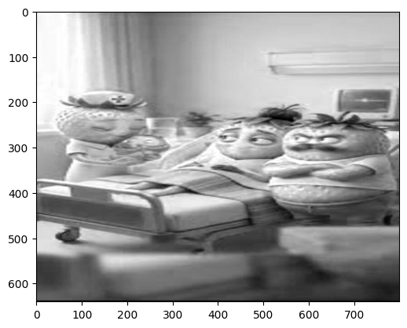
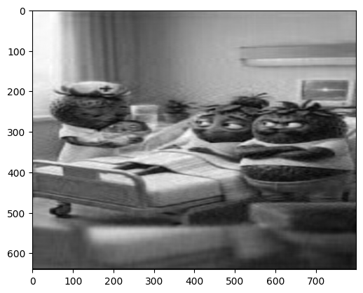

# SVD-сжатие изображений: Математический ML-Baseline


Алгоритм сжатия цифровых изображений, реализованный полностью с нуля с использованием **сингулярного разложения матриц (SVD)**. 

Проект демонстрирует фундаментальное понимание линейной алгебры и математики машинного обучения без использования высокоуровневых ML-библиотек (таких как `scikit-learn`). Показывает навык написания алгоритмов низкоуровневой тензорной обработки и факторизации матриц.

## Ключевые особенности
* **Тензорная обработка**: Разбиение RGB-изображения на отдельные матрицы цветовых каналов $m \times n$ для их независимой математической обработки.
* **Математика с нуля**: Собственная реализация алгоритмов вычисления собственных значений (Степенной метод, Метод вращений Якоби).
* **Усеченное SVD**: Восстановление изображения с использованием только первых $k$ сингулярных чисел для достижения максимального сжатия данных при сохранении визуальной целостности картинки.

## Результаты работы алгоритма
За счет отсечения «хвоста» массива сингулярных чисел (который математически представляет собой высокочастотный шум и мелкие детали), алгоритм достигает значительного сжатия веса файла. Оставшиеся старшие сингулярные числа сохраняют глобальную геометрию и цветовую заливку изображения.

*Пример сжатия при **k = 50** (Коэффициент сжатия: в ~6.4 раза)*

| Оригинал (До сжатия) | Сжатое изображение (SVD, k=50) |
| :---: | :---: |
|  |  |

*(Примечание: Алгоритм усечения также эффективно работает как неявный фильтр шумоподавления).*

## Как это работает
1. Исходное изображение загружается в память и разделяется на три матрицы (Red, Green, Blue).
2. SVD применяется к каждой цветовой матрице по формуле 

$$A = U \Sigma V^T$$

3. Полученные матрицы усекаются до первых $k$ компонент (формируется низкоранговая аппроксимация)</br>

$$A_k = U_k \Sigma_k V_k^T$$

## Быстрый старт
Чтобы воспроизвести результаты и запустить ноутбук локально:

```bash
git clone [https://github.com/Jlrukoluct28/SVD-Image-Compression.git](https://github.com/Jlrukoluct28/SVD-Image-Compression.git)
cd SVD-Image-Compression
pip install numpy matplotlib
